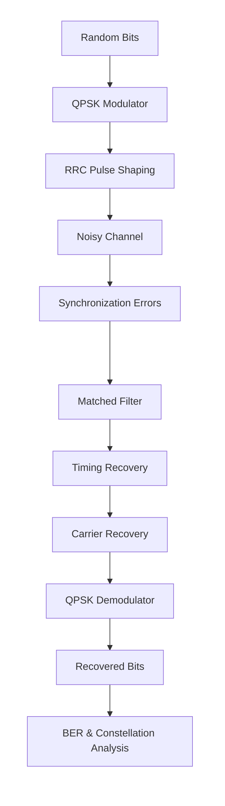

# Carrier and Timing Recovery for QPSK Communication

## Description

PCECT502 Analog and Digital Communication course project for B.tech Electronics and Communication Engineering @ College of Engineering Trivandrum (CET)
Done by Team 12 (Akul S Mohan, Samil R, Sandeep Santhosh K)

## About
A software-based QPSK communication receiver with carrier and timing synchronization. Random binary data will be QPSK modulated, pulse-shaped, and transmitted through a simulated channel containing noise, carrier frequency/phase offset, and timing error. At the receiver, matched filtering, timing recovery, and carrier recovery will synchronize the signal before QPSK demodulation. Constellation diagrams and BER measurements will be used for evaluation. 

## System Flow

## Authors

Akul S Mohan 
Samil R
Sandeep Santhosh K

## License

MIT License

## Acknowledgments

Thank you
